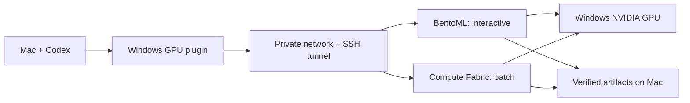

# ZeYu Windows GPU

> Mac 上写代码和使用 Codex，Windows 笔记本安静地提供 NVIDIA GPU。

这个项目起源于一个很具体的问题：我平时主要使用 MacBook 开发和学习，但真正需要 CUDA 的音频降噪实验、模型推理和 benchmark 都要在另一台 Windows 高性能笔记本上运行。过去每次都要切换电脑、重新进入项目、准备环境、执行命令、盯日志，再把结果复制回 Mac。GPU 很强，使用它的过程却很割裂。

我想要的不是远程桌面，也不是一个套着网页的 SSH 脚本，而是一块个人 GPU 后端：Mac 始终是唯一的开发和 AI Agent 工作环境；Windows 开机后成为后台计算节点；我在 Codex 里选择 **Windows GPU**，正常描述任务，结果最终回到当前 Mac。

## 最后做成了什么

项目有两条执行路径，但用户只看到一个入口：

- 单个 WAV、一次快速模型调用走 **Native Windows BentoML**。PyTorch 模型常驻显存，避免每次重新加载。
- benchmark、训练、数据集评估和长任务走 **Compute Fabric**。它保存队列、真实状态、日志、指标、环境身份和 artifacts。

两条路径共用一个很小的 GPU lease，避免常驻模型和重型 batch 同时挤爆同一张卡。Windows 服务只监听 loopback；Mac 通过 Tailscale 一类私网和严格校验主机密钥的 SSH 隧道访问，不把推理或命令接口暴露到公网。



插件提供七个内部工具：`gpu_status`、`infer_audio`、`submit_job`、`job_status`、`job_logs`、`fetch_artifacts` 和 `cancel_job`。日常使用时不需要记这些名字。

## 为什么是 BentoML + Compute Fabric

这条路线不是一开始就定下来的。前期依次研究或实测了几类方案。

### LUPINE / SCUDA：真正的远程 GPU 设备

[LUPINE](https://github.com/lupinemachines/lupine) 及其前身 [SCUDA](https://github.com/kevmo314/scuda) 最接近最初的理想：Mac 上的程序像使用本地设备一样，把 CUDA Driver/Runtime API 转发到远端 GPU。Apple Silicon 客户端库能够编译和加载，但原生 macOS PyTorch 本身没有 NVIDIA CUDA backend；加载转发库并不会让现有 PyTorch 自动获得 CUDA。细粒度 CUDA RPC 对音频模型里的大量小算子、同步和断线语义也更敏感。

这轮研究留下了一个重要边界：`REMOTE_GPU_DEVICE`、`REMOTE_FUNCTION_EXECUTION` 和 `REMOTE_JOB_EXECUTION` 是三件不同的事。项目不再把“SSH 跑脚本”描述成直接 GPU 调用，也没有为了追求透明 CUDA 而强行适配真实模型。

### Runhouse、Ray、Dask：本地调用远端函数

[Runhouse](https://github.com/run-house/runhouse) 的体验很有启发：在本地描述函数或对象，让模型在远端保持常驻。[Ray](https://github.com/ray-project/ray) 的 task/actor 和 [Dask](https://github.com/dask/dask) 的 Future 也能覆盖 remote function 场景。

它们的痛点并不是能力不够，而是对“一台 Mac + 一台 Windows + 一张 GPU”而言，完整的集群管理面、版本配套和额外运行组件超过了当前收益。我最终借鉴了它们的调用体验和持久对象思路，没有把个人双机系统改造成小型集群。

### BentoML：适合常驻模型的简单路径

[BentoML](https://github.com/bentoml/BentoML) 直接运行在 Windows 原生 Python/PyTorch CUDA 环境里。它提供成熟的服务生命周期、请求接口和常驻进程，我只需要保留真实模型 adapter、GPU 协调、错误语义和 artifact metadata。

这条路径维护层最短：没有额外 Linux 容器，模型加载一次后保持 warm，也容易从 Mac 经 loopback 隧道调用。因此它成为交互推理的正式入口。

### NVIDIA Triton：性能有价值，但维护更重

[NVIDIA Triton Inference Server](https://github.com/triton-inference-server/server) 的 Python Backend 在 WSL2 中也完成了真实 CUDA tensor、小网络、UNet、TIGER 和 WAV 返回。UNet 的实测延迟更好，gRPC 双向流也比 BentoML 的输出流更接近后续 streaming 需求。

但这台个人 Windows 节点还需要维护 WSL2、Docker、NVIDIA Container Toolkit、较大的 Triton 镜像，以及额外安装 PyTorch 的派生镜像。真实 TIGER 测试中 Triton 的中位数较低，但 p95/p99 波动比 BentoML 更大。现有模型也没有因为框架支持 streaming 就自动变成 stateful 实时模型。

所以 Triton 被保留为备选和对照，不作为第一版日常入口。这个决定只适用于本机、本组模型和“可靠性优先”的目标，不是框架通用排名。

## Compute Fabric 解决的痛点

BentoML 适合模型请求，却不能替代完整实验任务。Compute Fabric 保留了最初最需要的部分：

- job specification 包含项目别名、精确 Git commit、argv、参数、环境、timeout、artifact 路径和资源要求；
- SQLite 持久队列和 `QUEUED / STARTING / RUNNING / COMPLETED / FAILED / CANCELLED` 生命周期；
- stdout、stderr、CPU/GPU/显存指标、Python/依赖/系统身份；
- Windows Job Object 管理整个进程树，超时和取消不会只杀父进程；
- worker 重启后把不确定的运行任务标记为 `WORKER_INTERRUPTED`，不会擅自重复昂贵实验；
- artifact bundle 在 Mac 发布前核对文件大小和 SHA-256。

它仍然是 trusted single-user 工具，不是多租户沙箱，也没有引入 Kubernetes、Ray cluster 或复杂 scheduler。

## 项目结构

```text
plugin/          Codex 插件和 Mac 本地 MCP 客户端
runtime/bento/   BentoML 持久模型服务
runtime/windows/ Windows 进程监管器
compute-fabric/  batch worker、CLI、schema、脚本和测试
config/          不含真实地址或凭据的配置模板
docs/            安装、架构、实测范围和已知限制
scripts/         发布前隐私扫描
```

模型源码和 checkpoint 不在仓库中。使用者需要为自己的模型实现经过审计的 adapter，并通过 `ZEYU_UNET_ADAPTER`、`ZEYU_TIGER_ADAPTER` 等环境变量注册。公开测试使用 fixture adapter，只验证接口和故障语义，不冒充 GPU benchmark。

## 怎么用

完整流程见 [Installation](docs/installation.md)。Windows 侧需要：

- NVIDIA 驱动和能够实际使用 CUDA 的 PyTorch 环境；
- OpenSSH Server，以及只允许私网来源访问的规则；
- Tailscale 或同类私网；
- 专用非管理员 worker 账户；
- 自己的模型源码、checkpoint 和 adapter。

先在 Mac 做本地检查：

```bash
python3 -m venv .venv
.venv/bin/python -m pip install -r requirements-client.txt -e compute-fabric pytest
.venv/bin/python -m pytest tests compute-fabric/tests -q
python3 scripts/privacy_scan.py
```

复制 `config/client.example.json` 到私有配置目录，替换其中的占位符；SSH 私钥、known_hosts 和 worker token 都应留在权限受限的本地目录。然后按 Codex 当前支持的个人 marketplace 流程注册 `plugin/`，新建任务并选择 **Windows GPU**。

```text
[Windows GPU]

5070 Ti 在线吗？
用 UNet 处理这个 WAV。
用 5070 Ti 跑这组 benchmark。
```

安装插件本身不代表授权访问 Windows。只有当前任务明确选择插件后才建立连接。重启、防火墙、系统服务、驱动、BIOS/电源和破坏性文件操作仍需单独确认。

## 真实验证到哪里

内部实机使用 RTX 5070 Ti Laptop GPU 完成了 Native BentoML 和 Triton 两条真实模型路径，最终产品又验证了 BentoML 推理、Compute Fabric CUDA job、WAV/artifact 返回、异常、timeout、取消、服务崩溃恢复和 worker 运行中断恢复。

持续测试实际运行 1,201.342 秒，共 588 次请求，成功 588、失败 0。它没有达到原定 2–4 小时，因此这里只按 20 分钟测试记录；Windows 完整 reboot、不同普通网络和物理离线恢复也没有写成 PASS。详细数字和测量边界见 [Validation](docs/validation.md)。

公开仓库不包含原始日志、WAV、checkpoint hash、机器路径、地址、用户名、设备标识或 run ID。发布前 `scripts/privacy_scan.py --history` 会扫描工作树和完整 Git 历史，发现这些内容就失败。

## 当前限制

项目现在只处理一名可信用户、一台 Windows worker 和一张 GPU。TIGER 是双源语音分离，不代表已经验证因果降噪；10/20 ms stateful streaming、实时麦克风、Wake-on-LAN、Dashboard、多 GPU 和云节点都不在这个版本里。

更多边界见 [Known limitations](docs/limitations.md) 和 [Security](SECURITY.md)。

## License

Apache-2.0，见 [LICENSE](LICENSE)。
